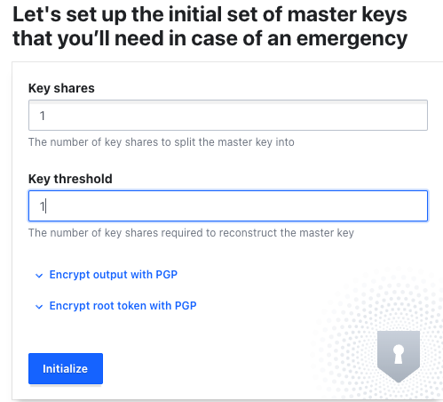
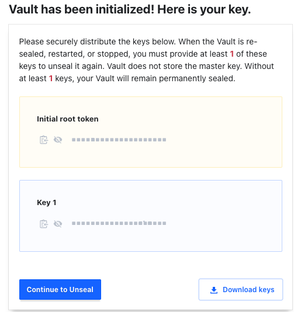
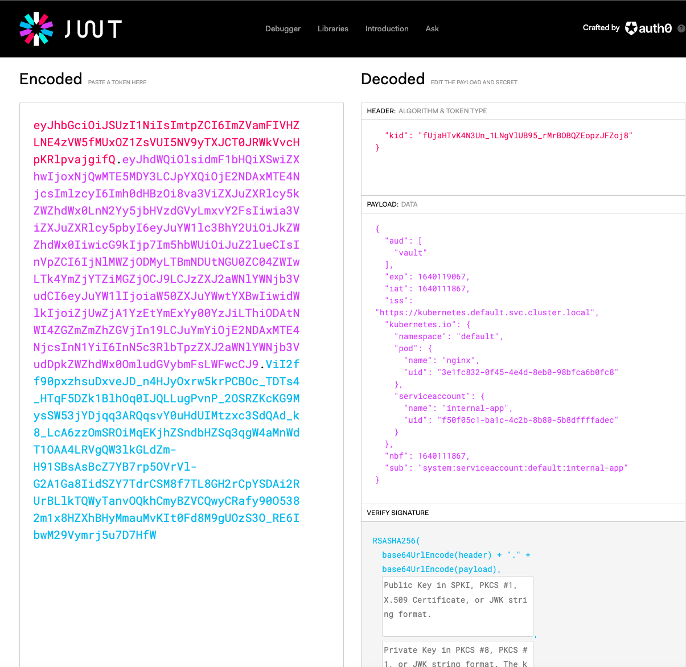

# Kubernetes Vault Auth

## Introduction

The Vault Auth mechanism is a solution for secrets introduction into Kubernetes. The initial secret is a JWT provided to the pod by the K8s server and tied to a cluster role using a cluster role binding. The token can then be used to do various things in vault like GET and LIST or secrets.

## You will need

* minikube (I have been using hyperkit for my VM)
* kubectl
* vault client
* docker
* internet access

> The Kubernetes Vault Auth Secrets Engine does not currently support token renewal. The `internal-app` you create provides a TTL of two months.
> By default, Vault has a max_ttl parameter set to 768h0m0s - that’s 32 days. If you want to set the TTL to a higher value, you need to modify this parameter.

## start Vault in Docker

This is a neat way to run Vault because you can build on it. The `vaultfiles` directory will persist between runs which allows you to build more complex a more Vault and one that will last beyond a reboot.

```console
docker run -p 8200:8200 -v "$(pwd)"/vaultfiles:/vault/file --cap-add=IPC_LOCK -e 'VAULT_LOCAL_CONFIG={"disable_mlock": true,"listener": {"tcp": {"address": "0.0.0.0:8200","tls_disable": true}},"backend": {"file": {"path": "/vault/file"}}, "default_lease_ttl": "168h", "max_lease_ttl": "720h","api_addr": "http://0.0.0.0:8200","ui": true}' vault server
```

vault will be availble at [http://localhost:8200](http://localhost:8200)

you will need to unseal and get the root token.



and



download the keys to your desktop.

Click `Continue to Unseal` you'll be promted to enter the key and since you only specified one, you only need the one in your JSON that you downloaded.

Next, Vault prompts you for a token. This is the root_token in your json file. Vault should now be unsealed and ready.

## start minikube

```console
minikube start --driver=hyperkit
```

## Set up Kubernetes

1. create the service account (sa)

```console
kubectl create sa internal-app
```

the service account needs permissions to do things in Kubernetes. To grant these powers, create a `ClusterRoleBinding`.

```yaml
# ClusterRoleBinding
---
apiVersion: rbac.authorization.k8s.io/v1
kind: ClusterRoleBinding
metadata:
  name: role-tokenreview-binding
  namespace: default
roleRef:
  apiGroup: rbac.authorization.k8s.io
  kind: ClusterRole
  name: system:auth-delegator
subjects:
- kind: ServiceAccount
  name: internal-app # this matches the name of the Service Account (SA)
  namespace: default
```

1. create the `ClusterRoleBinding`

```console
kubectl apply -f internal-app-CRB.yaml
```

## Set Up Vault

1. set some env vars and test vault access.

    ```console
    export VAULT_ADDR="http://localhost:8200"
    export VAULT_TOKEN="<token from vault>"
    ```

1. create some secrets and allow them to be read

    ```console
    vault secrets enable -path v1/kv-v2 kv
    ```

    ```console
    vault kv put v1/kv-v2/hello foo=world
    ```

    create a read only policy for the secrets, the policy should look like this.

    ```json
    path "v1/kv-v2/*" {
        capabilities = ["read", "list"]
    }
    ```

    apply the policy to the vault server.

    ```console
    vault policy write kv-test-ro kvpolicy.hcl
    ```

    test the policy and value retrieval

    ```console
    vault kv get v1/kv-v2/hello
    ```

1. Start with setting environment variables

Set VAULT_SA_NAME to `internal-app`, the service account you created earlier

```console
export VAULT_SA_NAME=$(kubectl -n default get sa internal-app -o jsonpath="{.secrets[*]['name']}")
```

Set SA_JWT_TOKEN value to the service account JWT used to access the TokenReview API

```console
export SA_JWT_TOKEN=$(kubectl -n default get secret $VAULT_SA_NAME -o jsonpath="{.data.token}" | base64 --decode; echo)
export SA_CA_CRT=$(kubectl -n default get secret $VAULT_SA_NAME -o jsonpath="{.data['ca\.crt']}" | base64 --decode; echo)
```

```console
export K8S_HOST="https://$(minikube ip):8443"
```

1. Enable the Kubernetes auth method at the default path ("kubernetes")

    ```console
    vault auth enable kubernetes
    ```

    > 💣 Vault is now more strict than before 🗡️ [disable JWT ISS validation](https://medium.com/pareture/hashicorp-kubernetes-vault-auth-claim-iss-is-invalid-abdd748c8ad6)
go into the [Vault console](http://localhost:8200), Authentication Methods --> Kubernetes -->  edit configuation --> Disable JWT Issuer Validation and SAVE! Did I mention to NOT use this in PRODUCTION !!!!

1. Hook Vault to the K8s cluster

    ```console
    vault write auth/kubernetes/config \
        token_reviewer_jwt="$SA_JWT_TOKEN" \
        kubernetes_host="$K8S_HOST" \
        kubernetes_ca_cert="$SA_CA_CRT"
    ```

1. Create a role named, `internal-app` which maps the Kubernetes `service account`

    ```console
    vault write auth/kubernetes/role/internal-app \
        bound_service_account_names=internal-app \
        bound_service_account_namespaces='*' \
        policies=kv-test-ro \
        ttl=1440h
    ```

## Deploy the pod

1. use the supplied `simplepod.yaml` which utilizes `volume projection`. The token is retrieved and placed into the pod.

    > You MUST set your laptop IP in the samplepod.yaml file before continuing or your pod won't be able to contact the Vault server in Docker. The sample pod is just a vault client.

    ```console
    kubectl apply -f simplepod.yaml
    ```

1. grab the JWT issued to the pod

    ```console
    kubectl exec -it vaultclient -- cat /var/run/secrets/tokens/vault-token
    ```

1. Inspect the JWT

    Inspect the JWT using [jwt.io](https://jwt.io). Never do this with "real" tokens.

    

1. Get token and read values from the deployed pod `vaultclient`

    ```console
    kubectl exec -it vaultclient -- sh
    ```

    ```console
    SA_TOKEN=$(cat /var/run/secrets/kubernetes.io/serviceaccount/token)
    ```

    ```console
    vault write auth/kubernetes/login role=internal-app jwt=$SA_TOKEN
    ```

    ```console
    vault login <copy-paste token from output> 

    ```console
    vault kv get v1/kv-v2/hello
    ```

## Extra - Service Account Permissions

> Note: Permissions given to the "default" service account are available to _any_ pod in the namespace that does not specify a serviceAccountName.

Service account permissions can be limited by namespace by namespace when creating the `rolebinding`. This example limits the serviceaccount `default` to `view` permissions exclusively in the namespace `my-namespace`.

```shell
kubectl create rolebinding default-view \
  --clusterrole=view \
  --serviceaccount=my-namespace:default \
  --namespace=my-namespace
```

https://kubernetes.io/docs/reference/access-authn-authz/rbac/#service-account-permissions

## Next steps

The kubernetes secret expires in every 32 days. We can redeploy more frequently or we'll need to figure out some rotation mechanism.
